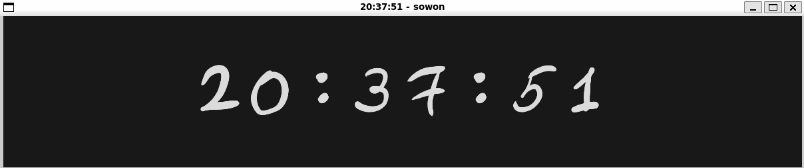

# Sowon Rust

> Use Rust clone from https://github.com/tsoding/sowon



## Usage

```sh
Usage: sowon-rust [OPTIONS] [SECONDS]

Arguments:
  [SECONDS]  Countdown seconds

Options:
  -p, --pause                 Start pause timer
  -m, --mode <MODE>           Mode [default: ascending] [possible values: ascending, countdown, clock]
  -e, --exit-after-countdown  In Countdown mode, exit when done
  -h, --help                  Print help
  -V, --version               Print version
```

### Key bindings

| Key | Description |
| --- | --- |
| <kbd>SPACE</kbd> | Toggle pause |
| <kbd>=</kbd> | Zoom in |
| <kbd>-</kbd> | Zoom out |
| <kbd>0</kbd> | Zoom 100% |
| <kbd>F5</kbd> | Restart |
| <kbd>F11</kbd> | Fullscreen |
